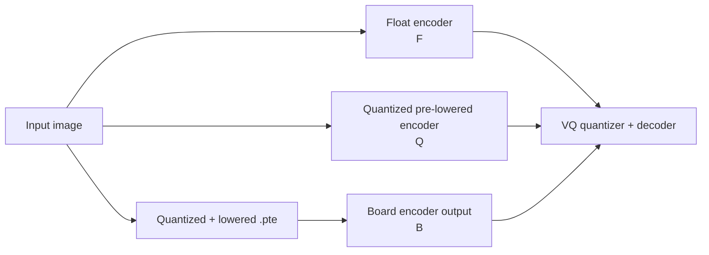
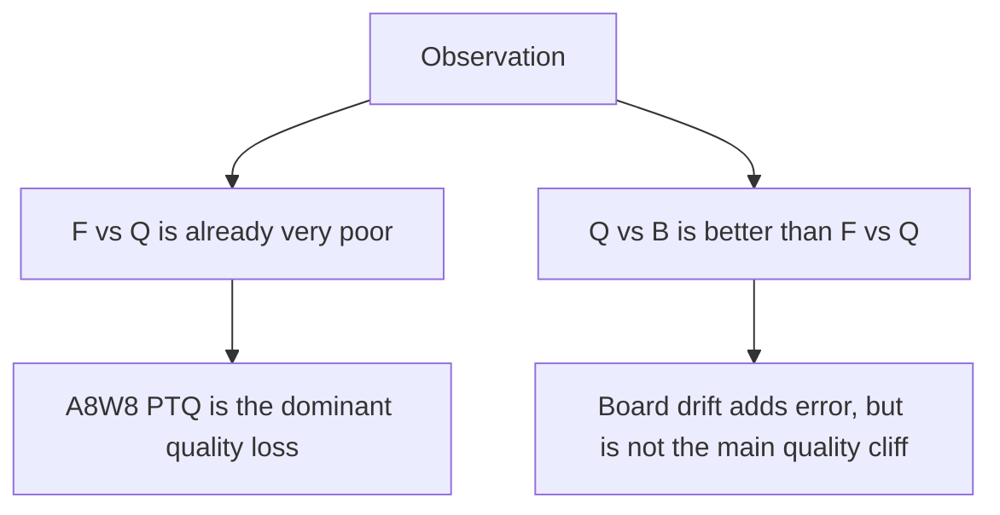
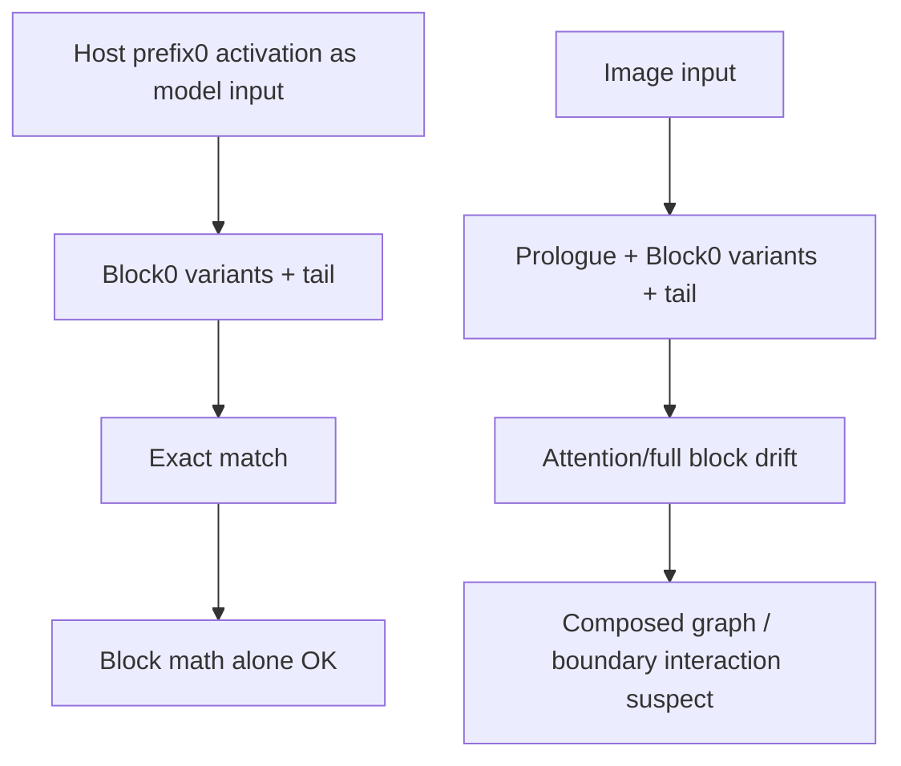

# Quantized Pre-Lowered vs Board Drift Debug Summary

## Goal

Determine whether the Ethos-U board run changes TiTok encoder outputs beyond the already-large A8W8 PTQ degradation.



## Main Checks

1. **Confirmed board input**
   - Generated CM33 input blob from the same crop used on host.
   - Verified host input blob and board input blob SHA matched byte-for-byte.

2. **Confirmed board artifact**
   - Transferred the lowered `.pte` to the board.
   - Verified host `.pte` and board `.pte` SHA matched byte-for-byte.

3. **Captured board output**
   - Board returned one output tensor.
   - Output shape: `[1, 12, 1, 128]`
   - Output dtype: float32
   - Run status: `invoke status = 0`, `bus_status_error = 0x0`, `cmd_end_reached = 0x1`

4. **Checked quantization grid**
   - Used output qparams to recover board int8 codes.
   - Host and board float outputs both lay on the same int8 quantization grid.
   - Therefore recovered int8-code comparison was valid.

5. **Checked output identity/layout**
   - Confirmed output count/index: exactly one output tensor.
   - Tried plausible layout permutations/reversals.
   - No permutation improved the match enough to explain the drift.

## Core Numeric Result

Known-runnable full unchunked BHLD matmul artifact, 4-image calibration:

| Comparison | Cosine | MAE | Max Abs Error |
| --- | ---: | ---: | ---: |
| F vs Q | `0.111160` | `0.289585` | `1.676090` |
| Q vs B | `0.716845` | `0.175118` | `1.451999` |
| F vs B | `0.147376` | `0.281335` | `1.510750` |

For Q vs B in recovered int8 codes:

| Metric | Value |
| --- | ---: |
| exact match fraction | `0.031250` |
| int8-code MAE | `20.864584` |
| max int8-code error | `173` |
| int8 cosine | `0.715206` |

## VQ / Decode Impact

We then passed F, Q, and B latents through the TiTok VQ quantizer and decoder.

| Metric | F vs Q | Q vs B | F vs B |
| --- | ---: | ---: | ---: |
| latent cosine | `0.111160` | `0.716845` | `0.147376` |
| latent MAE / int8-code MAE | `0.289585 / n/a` | `0.175118 / 20.864584` | `0.281335 / n/a` |
| VQ token exact agreement | `0.000000` | `0.031250` | `0.000000` |
| VQ top-5 agreement | `0.000000` | `0.101562` | `0.007812` |
| decoded PSNR | `11.653222` | `19.607192` | `10.101459` |
| decoded SSIM | `0.436110` | `0.609563` | `0.436460` |
| decoded LPIPS | unavailable | unavailable | unavailable |



## Localization: Where Drift Appeared

We ran block-0 probes two ways.

### A. Host Prefix Activation -> Block0 Variant -> Tail

Here the input to the lowered model was the exact host-generated `prefix0` activation. Every variant exact-matched board vs host.

| Variant | Int Exact | Int MAE | Int Max |
| --- | ---: | ---: | ---: |
| `norm1_only` | `1536/1536` | `0.000000` | `0` |
| `attention_branch_only` | `1536/1536` | `0.000000` | `0` |
| `attention_plus_residual` | `1536/1536` | `0.000000` | `0` |
| `mlp_branch_only` | `1536/1536` | `0.000000` | `0` |
| `full_block0` | `1536/1536` | `0.000000` | `0` |

Conclusion: the isolated block math was not inherently drifting when given the same activation tensor.

### B. Image -> Prologue -> Block0 Variant -> Tail

Here the model started from the real image and included the prologue in the lowered graph.

| Variant | Int Exact | Int MAE | Int Max | Int Cosine |
| --- | ---: | ---: | ---: | ---: |
| `norm1_only` | `1536/1536` | `0.000000` | `0` | `1.000000` |
| `attention_branch_only` | `1212/1536` | `0.287109` | `9` | `0.999803` |
| `attention_plus_residual` | `1366/1536` | `0.115234` | `4` | `0.999927` |
| `mlp_branch_only` | `1476/1536` | `0.039062` | `1` | `0.999991` |
| `full_block0` | `539/1536` | `0.934245` | `9` | `0.999363` |

Conclusion: the drift reappeared only when the prologue and block were composed in one lowered graph. That pointed away from “attention block alone is numerically broken” and toward an interaction at the prologue/block boundary, requantization boundary, or composed-graph lowering behavior.



## Chunking Experiments

We tried chunking BHLD attention to see whether smaller matmul/softmax regions reduced board drift.

### Head Chunking

Implementation split the attention heads:

```text
for h0 in range(0, num_heads, heads_per_chunk):
    qh = q[:, h0:h1, :, :]
    kh = k[:, h0:h1, :, :]
    vh = v[:, h0:h1, :, :]
    oh = softmax(qh @ kh.T) @ vh
out = cat(oh, dim=head)
```

On the one-block image->prologue->block0->tail probe, head chunking did not improve the drift.

### Query-Length Chunking

Implementation split query tokens instead of heads:

```text
for q0 in range(0, seq_len, query_chunk_size):
    q_chunk = q[:, :, q0:q1, :]
    oh = softmax(q_chunk @ k.T) @ v
out = cat(oh, dim=query)
```

Compile notes:

- `query_chunk_size = 64` failed Vela compile with a `ReduceMax` placement error.
- `query_chunk_size = 77` failed with the same error.
- `query_chunk_size = 128` compiled and ran.

One-block comparison:

| Variant | NPU Ops | Int8 Cosine | Int8 MAE | Int8 Max | Exact Fraction | Runtime |
| --- | ---: | ---: | ---: | ---: | ---: | ---: |
| unchunked BHLD | `435` | `0.999363` | `0.934245` | `9` | `35.09%` | `1772.215 ms` |
| head-chunked, 1 head/chunk | `589` | `0.999267` | `1.046875` | `8` | `32.42%` | `2006.612 ms` |
| query-chunked, 128 tokens/chunk | `522` | `0.999553` | `0.801432` | `6` | `39.26%` | `1828.737 ms` |

Query chunking helped slightly on the one-block probe, but it was not a fix.

Full-model query-chunked comparison:

| Variant | Int8 Cosine | Int8 MAE | Int8 Max | Exact Fraction | Dequant MAE |
| --- | ---: | ---: | ---: | ---: | ---: |
| unchunked full BHLD baseline | `0.697371` | `21.051432` | `190` | `2.86%` | `0.176686` |
| query-chunked full BHLD, q=128 | `0.730934` | `19.730469` | `150` | `3.52%` | `0.165599` |

Conclusion: query chunking reduced drift a little in both one-block and full-model tests, but the remaining full-model drift was still large.

## Experiments Tried

| Experiment | Result |
| --- | --- |
| Single controlled real-image capture | Board output parsed cleanly. |
| Host quantized pre-lowering vs final-export pre-lowering | Exact match. |
| Input blob SHA check | Host and board input matched. |
| PTE SHA check | Host and board `.pte` matched. |
| Grid residual check | Host and board outputs were on the inferred int8 grid. |
| Raw recovered int8 comparison | Valid; showed real Q vs B drift. |
| Output index/layout checks | No evidence of wrong output or flattening mismatch. |
| Prefix-growth runs | Drift accumulated after transformer blocks. |
| Block0 fed host prefix activation | Exact match for norm, attention, residual, MLP, and full block. |
| Image->prologue->block0 deep dive | Drift reappeared when prologue and block were composed. |
| Head chunking | Did not improve the one-block drift. |
| Query chunking | Slightly improved drift; not a fix. |
| Full-calibration BHLD `.pte` | Host build succeeded, but board did not emit output. |
| Known-runnable 4-image BHLD `.pte` VQ table | Completed; table above. |

## Conclusion

The board run does perturb the quantized encoder output, but the larger issue is the A8W8 quantization itself. In the known-good BHLD board run, Q vs B is much closer than F vs Q, and F vs B remains almost as poor as F vs Q. That means board drift is real but not the dominant reconstruction-quality failure.

## Key Artifacts

- `outputs/controlled experiment bhld matmul/`
- `outputs/bhld_4image_calibrated_vq_table/metrics_table.csv`
- `outputs/bhld_4image_calibrated_vq_table/qualitative_reconstruction_F_Q_B.png`
- `outputs/full_bhld_vq_quantizer_eval/`
